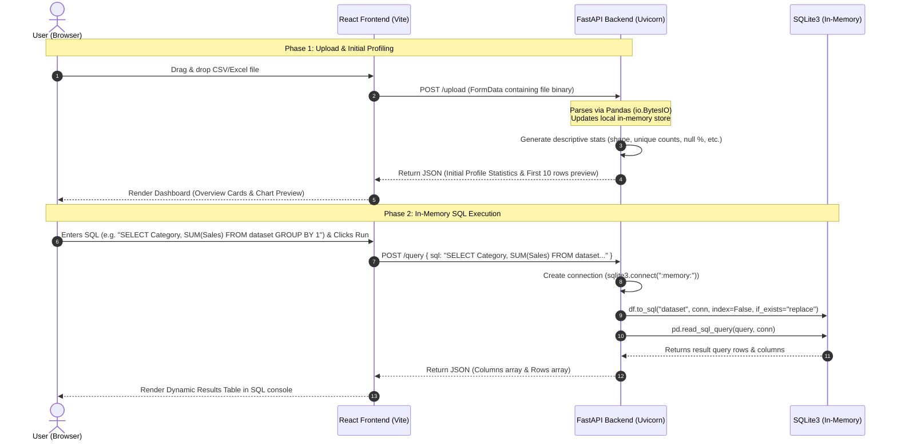

# 📊 DataLens — Interactive Dataset Analysis Dashboard

DataLens is a sleek, modern, single-page application (SPA) designed to help data analysts and developers instantly analyze, visualize, and run SQL queries against tabular datasets (CSV, Excel format) in real-time. By combining a **FastAPI (Python)** processing service with a highly responsive **React** user interface, DataLens requires zero database setup to run powerful SQLite queries directly over your in-memory datasets.

---

## 🔄 End-to-End Project Flow

Below is the step-by-step functional and data flow of the DataLens application, from initial file drag-and-drop to SQL query rendering:



---

## 🛠️ Step-by-Step Flow Details

### 1️⃣ Dataset Selection & Parsing
* **User Interaction**: The user drops a CSV or Excel (`.xls`, `.xlsx`) file onto the interactive drag-and-drop `UploadZone` or clicks **Browse file** to search locally.
* **Network Call**: The frontend reads the file and wraps it inside a multipart `FormData` payload, sending a `POST` request to `http://localhost:8000/upload`.
* **Backend Processing**:
  * FastAPI reads the raw incoming binary stream using `io.BytesIO`.
  * The file format is identified by extension (`.csv` uses `pd.read_csv`, while `.xlsx`/`.xls` uses `pd.read_excel` via `openpyxl`).
  * The parsed dataset is stored as a Pandas DataFrame inside an in-memory dictionary `df_store["current"]` for subsequent operations.

### 2️⃣ Automatic Statistical Profiling
* **Analysis Execution**: The backend invokes `analyze(df)` inside `analyzer.py`.
* **Metrics Computed**:
  * **Dimension Shape**: Total row and column counts.
  * **Schema Profiling**: Lists columns and their associated types (`int64`, `float64`, `object`, etc.).
  * **Missing Value Map**: Raw count and calculated null percentages per field.
  * **Cardinality Stats**: Counts of distinct unique values per field.
  * **Statistical Distribution**: Quartiles, min, max, means, standard deviations (via `df.describe()`).
* **UI Render**: Once the React app receives this JSON (which includes both `analysis` and `preview` datasets), it unlocks the **Overview** dashboard, rendering key metric cards (Data Quality percentage, Text count, Numeric count), initial Recharts projections, and populates the other navigation tabs instantly without requiring additional network queries.

### 3️⃣ Visualization Rendering
* **Data Projection**: The React app reads the returned dataset schema and finds numeric columns automatically.
* **Workspace Rendering**:
  * Under **Overview**, the user gets a preview chart with quick switches to toggle between **Bar**, **Line**, and **Area** representations of the top 10 rows.
  * Under **Charts**, the user is presented with a 2x2 grid containing specialized graphical visualizations:
    * **Bar Chart**: Direct row-by-row comparisons.
    * **Line Chart**: Pattern trends across rows.
    * **Pie Chart**: Category splits for categorical columns.
    * **Area Chart**: Smooth distribution contours.

### 4️⃣ Schema Health Inspection
* **Workspace**: Under the **Columns** navigation workspace.
* **Visual Diagnostics**: Displays a database-level view of all loaded columns. Includes an automated health indicator (`Good` under 5% null values, `Fair` between 5-20%, `Poor` above 20%) alongside linear progress bars showing the ratio of missing values.

### 5️⃣ SQLite In-Memory Query Console
* **User Interaction**: Under the **SQL** tab, users can write custom SQL code directly against their uploaded file or use standard preset templates.
* **Execution Flow**:
  * Clicking **Run Query** issues a `POST` query containing the raw SQL text to `/query`.
  * The backend initializes a fresh, temporary, virtual in-memory database connection via `sqlite3.connect(":memory:")`.
  * It maps the active Pandas DataFrame as a database table named **`dataset`** via `df.to_sql("dataset", conn)`.
  * It executes the user's custom SQL query via `pd.read_sql_query(query, conn)`.
  * It returns the column metadata and matching rows back to the client, which is immediately rendered in an interactive scrollable data grid. Any syntax errors are safely caught and displayed back in the console workspace.

---

## ⚙️ Tech Stack & Technologies

* **Frontend**:
  * **React (v19)**: Stateful UI component structures.
  * **Vite**: Ultra-fast hot-reloading compilation runner.
  * **Recharts**: D3-backed canvas drawing engine for interactive charts.
  * **Axios**: Promised-based client-server REST communicator.
* **Backend**:
  * **FastAPI**: Extremely fast ASGI microservice framework.
  * **Pandas**: Industry-standard data science and manipulation engine.
  * **SQLite3**: In-memory relational database compiler.

---

## 🚀 How to Setup and Run Locally

### 1. Run the Backend (FastAPI)
Navigate to the `Backend` directory:
```bash
cd Backend
```

Create a virtual environment (optional but recommended):
```bash
python3 -m venv venv
source venv/bin/activate
```

Install the dependencies:
```bash
pip install -r requirements.txt
```

Start the dev server on port `8000`:
```bash
uvicorn main:app --reload --port 8000
```

### 2. Run the Frontend (React + Vite)
Open a new terminal session and navigate to the `Frontend` directory:
```bash
cd Frontend
```

Install the node packages:
```bash
npm install
```

Start the Vite hot-reloading environment:
```bash
npm run dev
```

The application will launch on **`http://localhost:5173`**. Enjoy instant data exploration!
