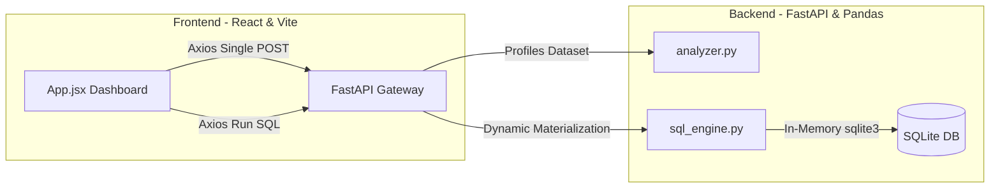

# 📊 DataLens — Interactive Dataset Analysis Dashboard

DataLens is an elegant, real-time data exploration and profiling dashboard designed to process CSV or Excel spreadsheets, visualize their distributions, and execute raw SQL queries using an in-memory database—all with **zero configuration** required.

🌐 **Live Vercel Application:** [https://data-lens-sepia.vercel.app/](https://data-lens-sepia.vercel.app/)

---

## 🏛️ System Architecture

DataLens implements a modern, decoupled client-server architecture:



### Key Architectural Concepts
1. **Single-Upload Dynamic Profiling**: The frontend makes exactly one `POST /upload` request to the backend. The backend parses the dataset, runs statistical profiling, prepares the top-10 preview rows, and returns a single nested JSON response containing both analysis and schema previews.
2. **Ephemeral In-Memory Storage**: Tabular data is parsed using `pandas` and stored as an ephemeral dataframe in backend process memory (`df_store`), ensuring that uploaded files are never cached or written to disk.
3. **Dynamic SQLite Engine**: When custom SQL is entered, the backend dynamically instantiates a virtual SQLite connection and materializes the active pandas dataframe into an in-memory table named `dataset` to execute custom `pd.read_sql_query` evaluations safely.

---

## 🚀 How to Run the Site

You can run the full application either using the quick automated runner script or by starting the backend and frontend services manually.

### Option A: Quick Dev Setup (Automated Script)

To get both the FastAPI backend and the React frontend up and running concurrently with a single command, execute the provided startup script in the repository root:

```bash
chmod +x start.sh
./start.sh
```

This shell runner script automatically:
* Installs/updates backend Python dependencies in your virtual environment or global environment.
* Boots the FastAPI gateway server via `uvicorn` on **`http://localhost:8000`**.
* Installs node packages and boots the React + Vite frontend compiler on **`http://localhost:5173`**.

### Option B: Manual Setup (Step-by-Step)

If you prefer to run the services in separate terminal windows, follow these instructions:

#### 1. Start the FastAPI Backend
Open a terminal window and navigate to the `Backend` directory:
```bash
cd Backend

# (Optional) Create and activate a virtual environment
python3 -m venv venv
source venv/bin/activate

# Install dependencies
pip install -r requirements.txt

# Start the API server
uvicorn main:app --reload --port 8000
```
The backend API documentation will be available at [http://localhost:8000/docs](http://localhost:8000/docs).

#### 2. Start the React Frontend
Open a new terminal window and navigate to the `Frontend` directory:
```bash
cd Frontend

# Install node dependencies
npm install

# Start the Vite dev server
npm run dev
```
The client dashboard will be available at [http://localhost:5173/](http://localhost:5173/).

---

## 🐍 Backend API Documentation

The FastAPI gateway automatically generates high-fidelity OpenAPI specifications and interactive playgrounds. Once the backend services are running, you can explore, test, and execute API endpoints directly from the browser:

* **Swagger UI Documentation**: [http://localhost:8000/docs](http://localhost:8000/docs)
* **ReDoc Documentation**: [http://localhost:8000/redoc](http://localhost:8000/redoc)

---

## 🛠️ Project Structure

```text
DataLens/
├── README.md              # Root repo architecture, startup runner, & doc links (This File)
├── start.sh               # Executable startup shell script
├── Backend/               # Python FastAPI backend service
│   ├── main.py            # API router mapping endpoints
│   ├── analyzer.py        # Pandas profiling engine
│   ├── sql_engine.py      # sqlite3 dynamic connector
│   └── requirements.txt   # Backend package manifests (FastAPI, Pandas, etc.)
└── Frontend/              # React single-page frontend application
    ├── README.md          # Frontend specific operational flow details
    ├── package.json       # Node package configurations
    └── src/
        └── App.jsx        # Integrated visual dashboard and logic
```
